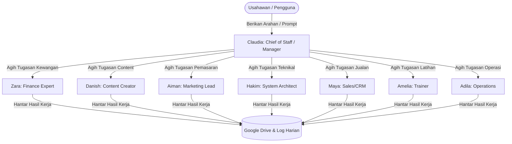
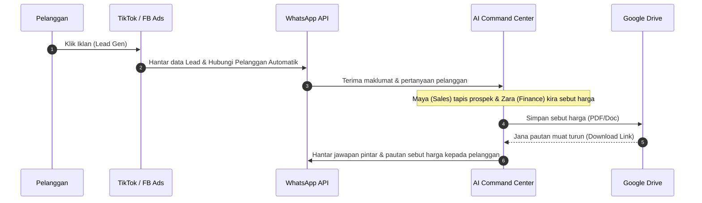

# 🚀 AI Command Center: Automasi Perniagaan Masa Depan Untuk Usahawan Pintar

Selamat datang ke masa depan pengurusan perniagaan. **AI Command Center** adalah platform orkestrasi *multi-agent* berkuasa tinggi yang menggantikan tugasan manual yang meletihkan dengan automasi kecerdasan buatan (AI) peringkat tinggi. 

Dirancang khas untuk usahawan yang ingin menskalakan perniagaan tanpa bebanan kos overhed pekerja yang tinggi, sistem ini berfungsi sebagai **Pejabat Maya 24/7** anda.

---

## 💡 Mengapa Usahawan Perlukan AI Command Center?

Di dalam dunia perniagaan yang kompetitif, kelajuan, konsistensi, dan kecekapan kos adalah kunci kemenangan. Sistem AI Agent ini menawarkan kelebihan yang tidak boleh ditandingi oleh struktur perniagaan tradisional:

| Cabaran Perniagaan Biasa | Solusi AI Command Center | Kesan kepada Bisnes Anda |
| :--- | :--- | :--- |
| **Gaji staf yang tinggi & caruman KWSP** | Ejen maya bekerja 24/7 tanpa cuti atau gaji bulanan. | Penjimatan kos operasi sehingga **70%**. |
| **Prospek lambat dilayan** | Balasan mesej & sebut harga dihantar sepantas kilat. | Kadar penukaran (conversion rate) meningkat. |
| **Ketiadaan idea pemasaran/copywriting** | Penjanaan konten viral & strategi iklan sedia dalam saat. | Pemasaran sentiasa aktif & relevan. |
| **Sistem data bersepah** | Automasi simpanan dokumen terus ke Google Drive. | Pengurusan fail yang kemas dan tersusun. |

---

## 👥 Tenaga Kerja Maya Anda (8 Ejen AI Bersedia Bertugas)

Sistem ini dikuasakan oleh model bahasa besar tercanggih (**NVIDIA NIM Llama 3.1 & Kimi**) dengan prinsip koordinasi "Manager-Worker". Anda hanya perlu bercakap dengan **Claudia (Manager)**, dan dia akan mengagihkan tugasan kepada pakar masing-masing:



### Senarai Profil Ejen Maya Anda:
1. **💼 Claudia (Chief of Staff)**: Otak utama pengurusan. Dia membaca matlamat perniagaan anda, memecahkannya kepada tugasan kecil, dan mengarah ejen lain menyiapkannya secara serentak.
2. **📈 Aiman (Marketing Lead)**: Pakar strategi penjenamaan. Aiman merangka pelan pemasaran fasa-demi-fasa dan menulis strategi iklan yang berkesan.
3. **✍️ Danish (Content Creator)**: Mesin copywriting anda. Menulis e-book, kandungan viral media sosial, dan bahan kreatif yang memikat hati pelanggan.
4. **📞 Maya (Sales & CRM)**: Jurujual berdedikasi. Maya menapis prospek panas, menjawab pertanyaan, dan menyediakan draf sebut harga (*quotation*).
5. **💰 Zara (Finance Expert)**: Pengawal kewangan anda. Mengira kos, bajet pengiklanan, invois, dan menyediakan laporan kewangan ringkas.
6. **🛠️ Hakim (System Architect)**: Bahagian IT & Teknikal. Hakim menulis kod, membaiki pepijat (bugs), dan memastikan integrasi sistem berjalan lancar.
7. **📚 Amelia (Trainer)**: Pakar pembangunan bakat. Amelia menyediakan modul latihan staf, nota edaran, dan slaid pembentangan.
8. **📊 Adila (Operations)**: Pengurus dokumentasi syarikat. Menyediakan laporan operasi harian dan menyusun log aktiviti perniagaan.

---

## ⚡ Pelan Naik Taraf & Integrasi Baharu (Tiktok Ads, FB Ads & WhatsApp)

Untuk menukar sistem ini menjadi sebuah **mesin jualan automatik penuh**, fasa naik taraf seterusnya akan menggabungkan platform pemasaran dan komunikasi terbesar di Malaysia:



### 1. 🎵 TikTok Ads Integration (Automasi Kreatif & Prestasi)
*   **Copywriting Skrip Video Viral**: AI Agent (Danish) akan menganalisis tren terkini di TikTok untuk menulis skrip video berdurasi 15-30 saat lengkap dengan *hook*, *body*, dan *Call to Action (CTA)*.
*   **Pengoptimuman Bajet Kempen**: Menyambungkan API TikTok Ads untuk memantau prestasi iklan secara masa nyata (Real-time ROAS). AI akan mencadangkan kempen mana yang perlu ditingkatkan (scale-up) atau ditutup bagi mengelakkan pembaziran bajet.

### 2. 🔵 FB Ads / Meta Integration (Sasaran & Analitis Pintar)
*   **Idea Kreatif & A/B Testing**: Menjana 5 variasi salinan iklan (ad copy) yang berbeza untuk produk yang sama dalam masa beberapa saat untuk melihat versi mana yang mendapat klik tertinggi.
*   **Pembinaan Profil Audiens (Targeting)**: Aiman (Marketing Lead) akan menganalisis jenis produk anda dan mencadangkan minat (Interests) serta demografi Facebook Ads yang paling tepat untuk disasarkan.

### 3. 🟢 WhatsApp Business Integration (Penutupan Jualan Automatik)
*   **Auto-Reply Responsif Berasaskan Konteks**: Tidak seperti bot tradisional yang kaku (rule-based), AI Agent (Maya) akan menjawab soalan pelanggan dengan gaya bahasa manusia yang natural dan mesra.
*   **Sebut Harga & Invois Automatik**: Sebaik sahaja pelanggan menyatakan minat dan kuantiti di WhatsApp, Maya dan Zara akan bekerjasama menghasilkan fail PDF sebut harga, menyimpannya di Google Drive, dan menghantar pautan dokumen tersebut terus ke WhatsApp pelanggan dalam masa 10 saat!

---

## 📅 Hala Tuju Naik Taraf Sistem (Roadmap)

Kami komited untuk menaik taraf sistem ini dari semasa ke semasa bagi memastikan ia sentiasa berada di hadapan teknologi pasaran:

*   **Fasa 1: Pelancaran & Integrasi Awan (Sedia Ada)**
    *   Sistem 8-Agent yang beroperasi secara harmoni.
    *   Penyimpanan automatik ke Google Drive menggunakan Google Apps Script.
    *   Dashboard web responsif berasaskan FastAPI.
*   **Fasa 2: Integrasi WhatsApp & Saluran Pemasaran (Fasa Seterusnya)**
    *   Penyambungan WhatsApp Business API (Green Tick / Cloud API).
    *   Automasi penyediaan dan penghantaran quotation menerusi sembang WhatsApp.
    *   Penghasilan skrip iklan TikTok & Meta Ads secara automatik di dashboard.
*   **Fasa 3: Dashboard Analitik & Pembelajaran Mesin (Roadmap Jangka Panjang)**
    *   Paparan grafik untuk prestasi ejen (kelajuan maklum balas, tugasan selesai).
    *   Penyambungan data kewangan langsung (Live Financial Tracking).
    *   Mod "Self-Correction" di mana AI belajar daripada maklum balas usahawan untuk memperbaiki kualiti kerja masa hadapan.

---

## 🛠️ Persediaan Mudah (Untuk Kegunaan Usahawan & Pembangun)

Sistem ini direka untuk dipasang dengan mudah sama ada di pelayan awan (cloud server) atau komputer pejabat anda:

1.  **Muat Turun Sistem**: Dapatkan kod sumber dan buka folder projek.
2.  **Masukkan Kunci API (API Keys)**: Sediakan fail `.env` yang mengandungi kunci NVIDIA NIM dan maklumat Google Drive anda.
3.  **Jalankan dengan Docker**:
    ```bash
    docker build -t ai-command-center .
    docker run -d -p 7860:7860 ai-command-center
    ```
4.  **Mula Guna**: Akses dashboard di komputer atau telefon pintar anda melalui penyemak imbas web (web browser).

---

## 🤝 Sertai Revolusi Automasi Perniagaan Hari Ini!
Jangan biarkan tugasan rutin melambatkan pertumbuhan empayar perniagaan anda. Dengan **AI Command Center**, anda bukan sahaja menjimatkan kos staf, malah mempunyai pasukan pakar bertaraf dunia yang bekerja untuk perniagaan anda 24 jam sehari, 7 hari seminggu.

*Bawa perniagaan anda ke fasa automasi mutlak sekarang!*
