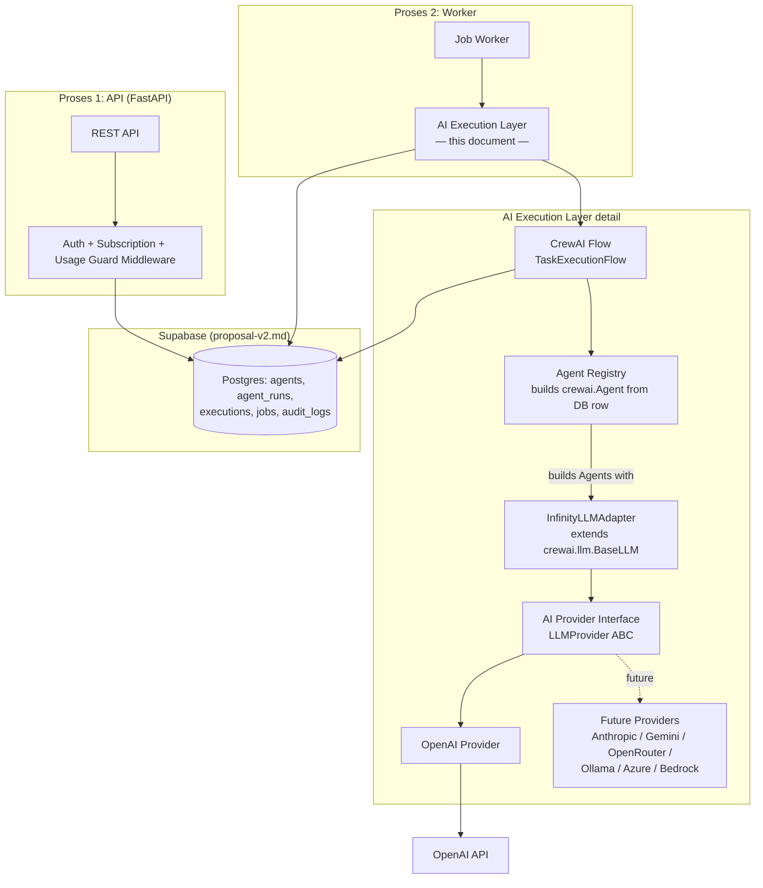
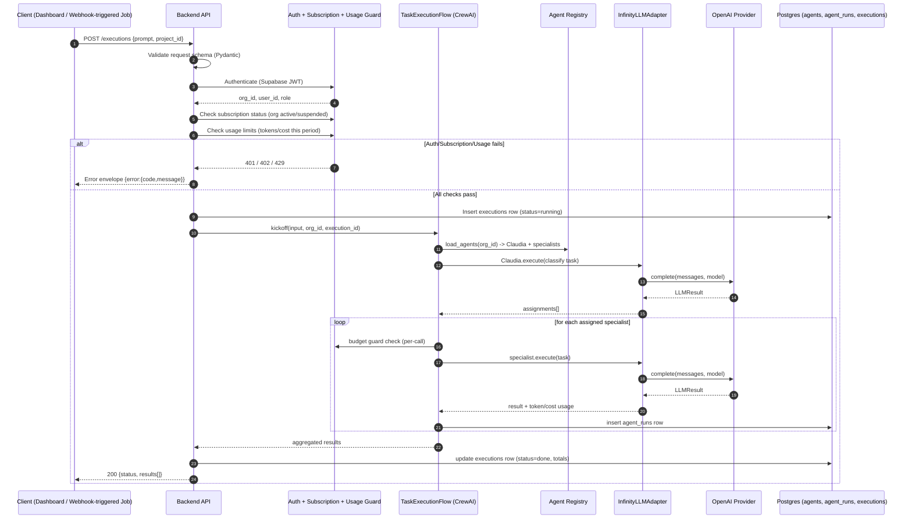
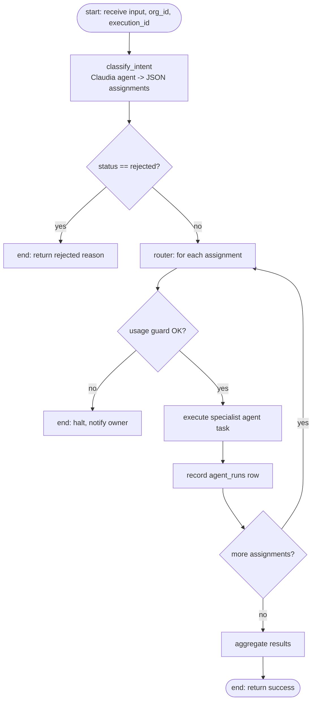
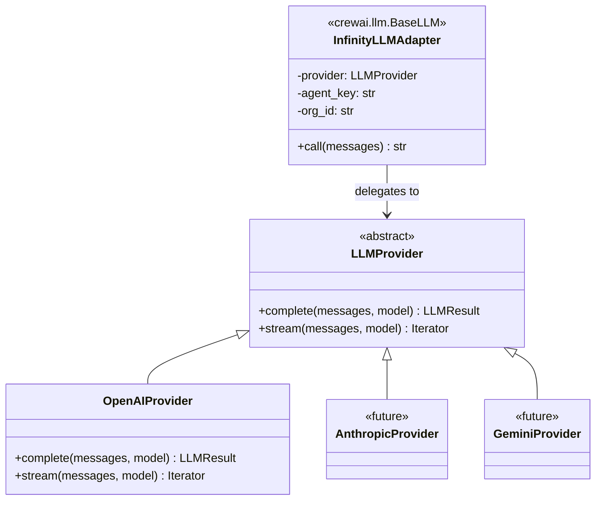

# AI Execution Architecture: CrewAI Orchestration + Provider-Agnostic LLM Layer

> **Status:** PROPOSAL — awaiting approval. No implementation until this document and [proposal-v2.md](proposal-v2.md) are both approved.
> **Date:** 2026-07-16
> **Scope:** This document designs the infrastructure that executes the 8 existing agent personas (Claudia + 7 specialists, currently defined in [`backend/src/core/constants.py`](../../backend/src/core/constants.py)) via CrewAI. **It does not redesign the agents.** Their roles, prompts, and business responsibilities are unchanged — only *how they get executed* changes.

---

## 0. Relationship to proposal-v2.md

[proposal-v2.md](proposal-v2.md) is the platform architecture of record for everything outside AI execution: multi-tenant Supabase schema, RLS, auth, RBAC, billing/subscription model, WhatsApp channel layer, jobs queue, and deployment topology. This document does not repeat or re-litigate those decisions.

This document **replaces**:
- proposal-v2.md §4 ("Senibina AI Orchestration") — the custom Claudia-routes-to-agents orchestrator.
- proposal-v2.md §6 provider paths — `ai/orchestrator.py`, `ai/registry.py`, `ai/providers/{base,nvidia,openai_compat}.py`.
- The provider assumption of NVIDIA NIM/Kimi as primary — **OpenAI is the only provider for MVP**, per explicit product direction. NVIDIA NIM/Kimi become one of several future providers behind the same abstraction (§4 below), not the default.

This document **retains, unchanged, by reference**:
- `organizations`, `org_members`, RBAC roles, RLS pattern — proposal-v2.md §2–3.
- `agents` and `agent_runs` tables (extended, not replaced — §7 below).
- `jobs` queue (Postgres `SKIP LOCKED`) — proposal-v2.md §7.
- Auth (Supabase Auth + JWT middleware) and channel layer — proposal-v2.md §5, §8.
- Budget guard / guardrails philosophy — proposal-v2.md §4 guardrails carry forward verbatim into §5 of this document.

Everywhere this document says "the org/auth/RLS/billing system," it means proposal-v2.md's design — not something new.

---

## 1. System Architecture

### 1.1 Where this fits in the whole platform



**Key architectural rule:** CrewAI never talks to OpenAI directly. Every `crewai.Agent` is constructed with `llm=InfinityLLMAdapter(...)`, and `InfinityLLMAdapter` is the *only* code in the system that calls into the AI Provider Interface. Agents, Crews, and Flows are 100% provider-unaware.

```
Application (our code)
    ↓
CrewAI (Agent / Task / Crew / Flow — coordination only)
    ↓
InfinityLLMAdapter (crewai.llm.BaseLLM subclass — the ONLY bridge)
    ↓
AI Provider Interface (LLMProvider ABC — our code)
    ↓
OpenAI Provider (MVP) | [future: Anthropic, Gemini, ...]
```

### 1.2 Why CrewAI's `BaseLLM` is the extension point (not litellm, not monkey-patching)

CrewAI ships a `crewai.llm.BaseLLM` abstract class specifically so host applications can plug in a custom model backend without CrewAI reaching into a hardcoded SDK. We use exactly that seam:

- **We never modify CrewAI source.** It is a pinned dependency (`crewai>=0.80,<1.0`, exact version locked at implementation time).
- **We never let CrewAI's default litellm routing pick the provider.** Every `Agent.llm` is explicitly our adapter instance.
- Adding a provider later means writing `ai/providers/anthropic_provider.py` implementing `LLMProvider` — zero changes to `InfinityLLMAdapter`, zero changes to any agent, crew, or flow definition.

### 1.3 Why CrewAI **Flow**, not a plain hierarchical Crew

CrewAI offers two coordination patterns: `Process.hierarchical` (a manager LLM autonomously decides delegation inside a black box) and **Flows** (`@start`/`@router`/`@listen` — explicit, inspectable Python control flow with typed state).

The current orchestrator (`backend/src/services/orchestrator.py`) already implements a deterministic two-step pattern: Claudia classifies → returns strict JSON → system executes only the assigned specialists. We keep that determinism because it's what makes the following non-negotiable (proposal-v2.md §4 guardrails) enforceable at all:

| Guardrail | Why it needs an explicit step boundary |
|---|---|
| Budget guard (halt before spend exceeds org limit) | Must run **before** any specialist LLM call, per specialist, not just once per request |
| `agent_runs` audit row per agent call | Needs a checkpoint after every individual agent execution, not just the final aggregate |
| Escalate to human on low confidence | Must be able to short-circuit mid-flow |
| "AI never invents prices" | Tool calls (future: `products` lookup) must be inspectable, not buried in an opaque manager LLM's internal reasoning |

A hierarchical Crew hides all of this inside one manager-LLM call. A Flow gives us a Python function per step, so each of the guardrails above is an ordinary `if` statement between steps. **Decision: `TaskExecutionFlow` (CrewAI Flow) is the primary pattern for MVP.** `Process.hierarchical` is not ruled out — it's documented in §10 as an option for a future fully-autonomous crew (proposal-v2.md M4/R&D phase), evaluated only after M1–M3 ship.

---

## 2. Folder Structure

Extends proposal-v2.md §6 (`app/` tree). This document only details the `app/ai/` subtree; everything else in that tree (`api/`, `services/`, `channels/`, `db/`, `workers/`) is unchanged.

```
app/ai/
├── providers/
│   ├── base.py              # LLMProvider ABC — complete(), stream(), (future) embed()
│   ├── openai_provider.py   # OpenAI implementation — the only concrete provider in MVP
│   ├── registry.py          # resolve_provider(org_id, agent_row) -> LLMProvider instance
│   └── errors.py            # ProviderError hierarchy, normalized across all future providers
├── crewai_adapter/
│   ├── llm_adapter.py       # InfinityLLMAdapter(BaseLLM) — the sole CrewAI<->Provider bridge
│   └── callbacks.py         # CrewAI step_callback/task_callback -> agent_runs + structured logs
├── agents/
│   ├── registry.py          # load_agents(org_id) -> dict[str, AgentConfig] (DB row -> config)
│   └── factory.py           # build_crewai_agent(config, llm) -> crewai.Agent
├── flows/
│   └── task_execution_flow.py   # TaskExecutionFlow(Flow): classify -> guard -> execute -> aggregate
├── tools/                   # crewai @tool wrappers (future: product lookup, quotation calc)
│   └── __init__.py
└── prompts/
    └── loader.py            # resolve system prompt: org override row > default template
```

| Directory | Why it exists |
|---|---|
| `providers/` | The only place that knows an OpenAI (or future Anthropic/Gemini/...) SDK exists. Nothing outside this folder imports `openai` or any other vendor SDK. |
| `crewai_adapter/` | Isolates all CrewAI-specific glue code (subclassing `BaseLLM`, wiring callbacks) so a future CrewAI major-version upgrade touches one folder, not every agent definition. |
| `agents/` | Turns a DB `agents` row (proposal-v2.md §3) into a `crewai.Agent` object. This is where "agents already exist in the app" becomes "agents are CrewAI-executable" — no prompt content is authored here, only assembly. |
| `flows/` | Business-logic-bearing orchestration (routing, guardrails, aggregation). This is the only place allowed to sequence multiple agents — mirrors current `orchestrator.py` responsibility. |
| `tools/` | Future CrewAI `@tool`-decorated functions (e.g., `lookup_product_price`) so agents can call real data instead of inventing it — enforces proposal-v2.md §4 guardrail #1. Empty in MVP; scaffolded now so Flow code has a stable import path. |
| `prompts/` | Single place that decides "which system prompt text does this agent get" — default template vs. per-org override (`agents.system_prompt` column, proposal-v2.md §3). Keeps prompt resolution out of both `agents/factory.py` and `flows/`. |

---

## 3. Execution Flow (Request Lifecycle)

### 3.1 Canonical lifecycle



This is the same sequence for both call sites:
- **Synchronous** — dashboard's `POST /executions` (small, interactive tasks; today's UX).
- **Asynchronous** — a `jobs` handler (`process_inbound`, proposal-v2.md §7) calls the identical `TaskExecutionFlow.kickoff(...)` from a worker process instead of the API request thread. The Flow code is transport-agnostic; only the caller differs.

### 3.2 `TaskExecutionFlow` internal steps



This is a direct CrewAI-native re-expression of the current `execute_task()` function in `orchestrator.py` — same steps, same guardrails, now expressed as Flow state transitions instead of a single Python function, which makes each step independently testable, retryable, and observable.

---

## 4. AI Provider Architecture

### 4.1 Interface

```python
# app/ai/providers/base.py
class LLMResult(TypedDict):
    text: str
    tokens_in: int
    tokens_out: int
    cost_usd: float
    duration_ms: int
    model: str
    provider: str

class LLMProvider(ABC):
    @abstractmethod
    def complete(self, messages: list[Message], model: str, **kwargs) -> LLMResult: ...

    @abstractmethod
    def stream(self, messages: list[Message], model: str, **kwargs) -> Iterator[str]: ...
    # stream() is defined in the interface now (Phase 2 consumer) so no MVP provider needs
    # a breaking signature change later — OpenAIProvider implements it from day one.
```

### 4.2 Provider resolution



`agents.provider` (proposal-v2.md §3 already has this column) selects the provider per agent, per org. For MVP the column is constrained to `'openai'` at the application layer (not a DB CHECK constraint, so no migration is needed when providers are added later — `registry.py` raises a clear `UnsupportedProviderError` for anything else today).

```python
# app/ai/providers/registry.py
def resolve_provider(agent_row: AgentRow) -> LLMProvider:
    if agent_row.provider == "openai":
        return OpenAIProvider(api_key=get_openai_key(agent_row.org_id))
    raise UnsupportedProviderError(agent_row.provider)  # MVP: everything else fails loudly
```

`get_openai_key(org_id)` returns the platform-wide key from env for MVP; the function signature already takes `org_id` so Phase 4 "bring your own key" (per-org encrypted key, mirroring `channels.config` pattern from proposal-v2.md §3) is a change inside this one function, not a call-site change anywhere else.

### 4.3 Normalized error handling

```python
# app/ai/providers/errors.py
class ProviderError(Exception): ...
class ProviderAuthError(ProviderError): ...
class ProviderRateLimitError(ProviderError): ...
class ProviderTimeoutError(ProviderError): ...
class ProviderContextLengthError(ProviderError): ...
```

Every concrete provider catches its SDK's native exceptions and re-raises one of the above. Nothing above `providers/` ever sees an `openai.APIError` or any other vendor exception type — this is what makes swapping providers safe.

**CrewAI's own retry (discovered during implementation, not something we built):** `crewai.Agent.execute_task()` already retries a failing `llm.call()` up to `max_retry_limit` (default 2) before re-raising the same exception type. A `ProviderError` from `InfinityLLMAdapter.call()` is retried automatically by CrewAI; only a *persistent* failure (every retry also fails) reaches `TaskExecutionFlow`'s own `except ProviderError` (§3.2, §5). We rely on this rather than re-implementing retry logic ourselves — no proxy layer is needed for Phase 4's "retry strategies" (§8), CrewAI already provides it per-agent.

---

## 5. CrewAI Integration Design

### 5.1 Agent assembly

```python
# app/ai/agents/factory.py
def build_crewai_agent(config: AgentConfig, llm: InfinityLLMAdapter) -> Agent:
    return Agent(
        role=config.role,             # e.g. "Finance Expert" (from agents.role_key + metadata)
        goal=config.goal,             # derived from system_prompt via prompts/loader.py
        backstory=config.backstory,   # derived from system_prompt via prompts/loader.py
        llm=llm,
        allow_delegation=False,       # specialists never re-delegate; only Claudia routes
        verbose=False,
    )
```

Claudia is built the same way but is never given `allow_delegation` inside CrewAI's own mechanism — her "delegation" is our Flow's routing step (§3.2), not CrewAI's internal manager-agent delegation. This keeps the guardrail-enforcing control in our code, per §1.3.

### 5.2 Guardrails carried forward (proposal-v2.md §4, unchanged)

1. Agents only use prices/data from real tables (future `tools/` functions) — never invent facts.
2. Low confidence or out-of-scope → escalate to human, don't guess.
3. Every action-triggering agent output is written to `audit_logs` with `actor_type=agent`.
4. Per-org daily token/cost budget guard halts execution before overspend, notifies the owner.

All four are implemented as ordinary Python checks inside `TaskExecutionFlow`, not CrewAI configuration — CrewAI has no awareness of any of them, matching "CrewAI should only coordinate execution."

### 5.3 What CrewAI owns vs. what we own

| Concern | Owner |
|---|---|
| Agent role/goal/backstory objects, Task objects, Flow step wiring | CrewAI (framework mechanics) |
| Which agents exist, their prompts, their business roles | Our code (`backend/src/core/constants.py` → migrated to `agents` DB table) |
| Which provider/model an agent uses | Our code (`ai/providers/registry.py`) |
| Budget, audit, escalation, retries | Our code (`ai/flows/task_execution_flow.py`) |
| Actual model API calls | Our code (`ai/providers/openai_provider.py`) — CrewAI never touches an SDK directly |

---

## 6. API Design

Extends proposal-v2.md §7 (endpoint table). New/changed endpoints for the AI execution layer:

| Method & Path | Function | Role min | Status |
|---|---|---|---|
| `POST /executions` | Start an execution (Crew/Flow run) for a project | staff | MVP |
| `GET /executions/{id}` | Execution status + result | staff | MVP |
| `GET /executions?project_id=&status=` | Execution history for a project | staff | MVP |
| `GET /projects/{id}/executions` | Project-scoped execution history | staff | MVP |
| `GET /executions/{id}/stream` | SSE streaming of in-progress output | staff | Phase 2 (design now, implement later) |
| `POST /executions/{id}/cancel` | Cancel a running execution | staff | Future — documented, not implemented |
| `POST /executions/{id}/resume` | Resume a halted/failed execution | staff | Future — depends on CrewAI Flow `@persist` state, documented, not implemented |

`process_inbound` and other `jobs` (proposal-v2.md §7) are internal callers of the same `TaskExecutionFlow`, not separate API endpoints.

**Cancellation/resume note:** CrewAI Flows support a `@persist` decorator that checkpoints state to a backing store. Phase-2+ implementation would persist `TaskExecutionFlow` state keyed by `execution_id`, letting `/resume` re-enter the Flow at the last completed step. This is a documented future capability, not built in MVP — MVP executions are short-lived enough (single dashboard request) that resume isn't needed yet.

---

## 7. Database Impact

Extends proposal-v2.md §3. No breaking changes to existing tables; one new table.

### 7.1 `agents` (existing table, no schema change)

`provider` column values constrained at the application layer to `'openai'` for MVP (see §4.2). `system_prompt` remains the single source of prompt text; CrewAI `role`/`goal`/`backstory` are derived from it at agent-build time (`prompts/loader.py`), not stored as separate columns — avoids a migration for a presentation-layer split that CrewAI needs but the DB doesn't.

### 7.2 `agent_runs` (existing table, no schema change)

Already has `tokens_in`, `tokens_out`, `cost_usd`, `duration_ms`, `status`, `error` (proposal-v2.md §3) — exactly what `InfinityLLMAdapter`'s `LLMResult` produces. One row is written per specialist agent call inside the Flow's `RECORD` step (§3.2), same granularity as today's `orchestrator.py`.

### 7.3 `executions` (new table)

One user request or job can fan out into several `agent_runs` (Claudia + N specialists). `executions` is the parent grouping row the new API endpoints (§6) read from.

| Column | Type | Notes |
|---|---|---|
| `id` | uuid pk | |
| `org_id` | uuid fk | RLS scoped, same pattern as every other table |
| `project_id` | uuid fk nullable | Groups executions by project (dashboard concept) |
| `status` | text | `running` \| `done` \| `failed` \| `rejected` \| `halted_budget` |
| `input_summary` | text | Truncated prompt, not full PII-bearing content |
| `output_summary` | text | Truncated aggregate result |
| `total_tokens` | int | Sum of child `agent_runs` |
| `total_cost_usd` | numeric | Sum of child `agent_runs` |
| `triggered_by` | text | `dashboard` \| `job:{job_type}` |
| `started_at`, `completed_at` | timestamptz | |

RLS policy identical to every other table in proposal-v2.md §3 (`tenant_isolation` on `org_id`).

---

## 8. Scalability Plan

Directly follows the four phases specified for this platform; each maps onto proposal-v2.md's own phase plan rather than introducing a parallel timeline.

**Phase 1 (matches proposal-v2.md M0–M1):** Single API + worker instance, `TaskExecutionFlow` runs in-process, OpenAI only, Supabase Postgres for `agents`/`agent_runs`/`executions`. No queue beyond the existing Postgres `jobs` table.

**Phase 2:** `/executions/{id}/stream` SSE implemented — `InfinityLLMAdapter.stream()` (already in the interface, §4.1) forwards provider stream chunks through the Flow to the API. Background jobs already exist (proposal-v2.md §7); this phase adds Redis only if Postgres `jobs` throughput becomes the bottleneck (proposal-v2.md's own stated threshold: ~50 jobs/sec), not before.

**Phase 3:** Multiple worker processes running Flows concurrently (`SKIP LOCKED` already makes this safe per proposal-v2.md §7). Add response caching for identical classification calls (Claudia re-classifying near-duplicate prompts), structured tracing per `execution_id`/`org_id` (§9 below), and a load balancer in front of horizontally-scaled API instances (stateless already, per proposal-v2.md §8).

**Phase 4:** `ai/providers/registry.py` (§4.2) gains real multi-provider logic: cost-based or latency-based model selection, automatic fallback (OpenAI → secondary provider on `ProviderRateLimitError`/`ProviderTimeoutError`), per-provider health monitoring feeding into the registry's routing decision. Because every provider implements the same `LLMProvider` interface (§4.1) and every agent is provider-unaware (§1.2), this phase touches only `providers/` and `providers/registry.py` — no agent, crew, or flow code changes.

---

## 9. Security Considerations

Extends proposal-v2.md §8; AI-execution-specific additions:

- **API authentication/authorization:** unchanged — Supabase JWT + RBAC (proposal-v2.md §2, §8). The AI execution layer trusts `org_id`/`role` already resolved by that middleware; it does not re-implement auth.
- **Secrets management:** OpenAI API key via env var for MVP (platform-wide, one key). Never logged — `callbacks.py` (§2 folder table) redacts any `Authorization`-shaped values before writing structured logs. Per-org BYO-key (Phase 4) will reuse proposal-v2.md's existing encrypted-config pattern (`channels.config` already does this for WhatsApp tokens).
- **Provider key isolation:** worker/API processes hold the key server-side only; never returned in any API response, never passed to CrewAI's `Agent` objects directly (only `InfinityLLMAdapter` holds a `LLMProvider` instance that internally holds the key).
- **Prompt injection considerations:**
  - Conversation history and any future tool outputs are passed to agents as *data*, never concatenated into system prompts as instructions — the current `AGENT_PROMPTS` structure already keeps system/user roles separate; this is preserved.
  - Future `tools/` functions (§2) validate and sanitize their inputs; an agent's free-text output is never used to construct a raw SQL query or shell command — tool functions take typed parameters only.
  - Claudia's JSON-assignment output is parsed defensively (same `extract_json`/fallback-regex pattern already in `orchestrator.py`/`logging.py`) — malformed or adversarial output degrades to a rejected execution, never to arbitrary code execution.
  - Agents cannot invoke `products`/pricing tools with values that bypass the guardrail "prices only from `products` table" (proposal-v2.md §4 guardrail #1) — tool functions read from the DB, they don't accept a price as an agent-supplied argument.
- **Audit logging:** every specialist execution writes `agent_runs` (§7.2); every action-triggering result (future: quotation creation, message send) writes `audit_logs` with `actor_type=agent`, matching proposal-v2.md §4 guardrail #3.
- **Rate limiting:** existing API-level rate limiting (proposal-v2.md §8) applies to `/executions`; the per-org usage guard (§3.1, §5.2 guardrail #4) is a separate, budget-based limit, not a substitute for request-rate limiting.

---

## 10. Implementation Plan

Sequenced as a sub-track of proposal-v2.md's **M0 — Foundation** milestone (not a new top-level milestone — this is infrastructure M0 already anticipates: "lapisan provider LLM + pindahkan 8 agent prompt sedia ada ke DB").

1. **Provider layer** — `ai/providers/base.py`, `ai/providers/errors.py`, `ai/providers/openai_provider.py`, `ai/providers/registry.py`. Unit-testable in isolation, no CrewAI dependency yet.
2. **CrewAI adapter** — pin `crewai` dependency; `ai/crewai_adapter/llm_adapter.py` (`InfinityLLMAdapter(BaseLLM)`) wrapping the provider layer; `ai/crewai_adapter/callbacks.py` for `agent_runs` recording. Verify with a single hardcoded agent + task, no Flow yet.
   **Deployment note (discovered during implementation):** CrewAI's first `Crew`/`Flow` kickoff on any given machine triggers a one-time interactive "view your execution traces? [y/N]" `input()` prompt (`crewai/events/listeners/tracing/utils.py`), gated behind the `CREWAI_TESTING` env var. Worker/API process startup (§10 step 6-7) must set `CREWAI_TESTING=true` — matching what `backend/tests/conftest.py` already does for the test suite — otherwise the first execution on a fresh container blocks on stdin for up to 20s.
3. **Agent registry** — `agents` table migration if not already present (proposal-v2.md M0 scope); `ai/agents/registry.py` + `ai/agents/factory.py` + `ai/prompts/loader.py`. Migrate the 8 existing prompts from `constants.py` into `agents` rows (org_id NULL = default template, per proposal-v2.md §3).
4. **`executions` table** — migration per §7.3, with RLS policy.
5. **`TaskExecutionFlow`** — `ai/flows/task_execution_flow.py` implementing §3.2, replacing `backend/src/services/orchestrator.py`'s manual JSON-parsing loop with equivalent Flow steps + guardrails. The JSON/regex-fallback parsing of Claudia's decision is unchanged (reuses `services/logging.extract_json` plus the same fallback regex), so Claudia's routing behavior is byte-for-byte identical to today's — only the execution engine changed. The per-org usage/budget guard (§5.2 guardrail #4) is stubbed to always-allow pending the `organizations`/`agent_runs` DB table (§7, deferred — no live Supabase project yet); the call site (`execute_specialists`) already checks its return value before every specialist run, so wiring in real budget logic later is a one-function change.
6. **API endpoints** — implemented: `POST /api/executions` (§6), reusing the existing session-cookie auth (`verify_session`) since the Supabase JWT/org auth layer (proposal-v2.md §8) doesn't exist yet — `org_id` is hardcoded `None` until it does, so every execution runs on the platform-wide OpenAI key (§9). Deferred: `GET /executions/{id}` and `GET /executions` history listing — both need the `executions` table (§7.3, deferred with Step 4) to read from; there is nothing to list without it.
7. **Cutover** — swap the dashboard's existing `/api/execute` call to the new `/executions` endpoint; keep the old endpoint as a thin deprecated alias until frontend is updated, then remove.
8. **Acceptance test** — implemented as `backend/tests/test_acceptance_parity.py`: given identical scripted LLM responses, `TaskExecutionFlow` and `orchestrator.py` are asserted to produce identical `ExecuteResponse`s across 6 scenarios (happy path, multi-specialist, rejected, malformed JSON, unknown agent, no assignments). `agent_runs`/`executions` row comparisons are out of scope pending the deferred DB (§7). `orchestrator.py`/`/api/execute` are kept, deprecated, until this is reviewed — not yet deleted.

**Status: Steps 1-8 implemented** (2026-07-17) with the DB-dependent pieces (Steps 4, part of 6) deferred pending a live Supabase project — see the deferral notes inline above. 65 backend tests pass, including a live end-to-end verification against the real OpenAI API (confirmed correct request/response wiring and error normalization; blocked only by the target OpenAI account's billing/quota, not by this code). Remaining before this can be considered done-done: stand up the real `agents`/`executions`/`agent_runs` tables once a Supabase project exists (unblocks per-org prompt override, execution history endpoints, and the real usage/budget guard), then delete `orchestrator.py` and `/api/execute`.

Deliberately **not** in this implementation pass (documented here so it isn't silently dropped): streaming endpoint (§6 Phase 2), cancel/resume (§6 future), multi-provider routing (§8 Phase 4), CrewAI `tools/` for real product/pricing lookups (needed before quotation auto-generation in proposal-v2.md M1 — tracked there, not here).
