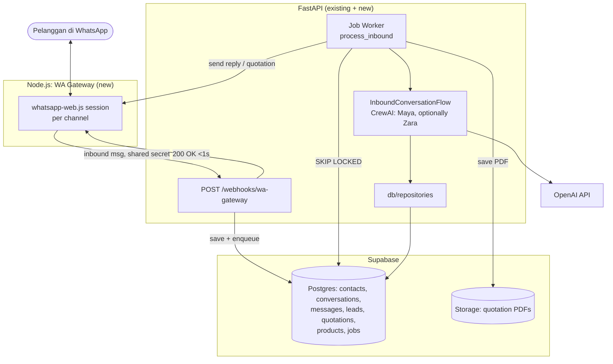
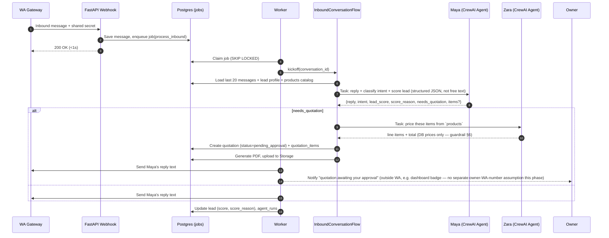

# M1: WhatsApp Sales Funnel — Technical Design

> **Status:** PROPOSAL — awaiting approval, no implementation beyond this document until agreed. Written per proposal-v2.md's own stated policy ("setiap milestone akan ada dokumen teknikal terperinci sendiri sebelum implementasi").
> Date: 2026-07-17

## 0. Scope & relationship to prior documents

Implements [proposal-v2.md](proposal-v2.md)'s **M1 — WhatsApp Sales Funnel** milestone (§10) and its WhatsApp channel layer design (§5). Reuses the AI execution layer from [ai-execution-crewai.md](ai-execution-crewai.md) (CrewAI + `InfinityLLMAdapter` + `OpenAIProvider`) for Maya and Zara instead of proposal-v2.md's original custom-orchestrator sequence diagram (§4) — same substitution rationale as that document.

**Decisions locked in for this phase** (temporary departures from proposal-v2.md's full multi-tenant design, agreed before writing this doc):

| Decision | What it means here |
|---|---|
| Persistence | Real Supabase Postgres. Schema matches proposal-v2.md §3 **exactly**, including `org_id` columns on every table — but **RLS policies are not applied yet**, and exactly one `organizations` row is seeded (`00000000-0000-0000-0000-000000000001`, name "Default"). Every table's `org_id` FK points at that row. This is a zero-migration path to real multi-tenancy later: turning it on is "write RLS policies + stop hardcoding the org id," not a schema change. |
| WhatsApp provider | `whatsapp-web.js` only (pilot). Meta Cloud API adapter (`channels/wa_cloud.py`) is designed for but not implemented this phase. |
| Workflow | I write code and **migration files only**. A teammate who owns the live Supabase project reviews and applies them. I never call `apply_migration`/`create_project` against live infrastructure. |
| Auth | Unchanged — still the single hardcoded `ADMIN_EMAIL`/`ADMIN_PASSWORD` dashboard login. Nothing in this phase adds per-user auth; the WhatsApp side has no "user" concept anyway (it's contacts/leads, not dashboard users). |

**Explicit non-goals this phase:** RLS/multi-org, Meta Cloud API, follow-up campaigns, daily briefing (M1.5), content/ads (M2), inventory (M3).

---

## 1. System architecture



**Critical rule carried over from proposal-v2.md §1: "webhook tak fikir, worker yang fikir."** `/webhooks/wa-gateway` only saves the inbound message and enqueues a `process_inbound` job, then returns `200 OK` in milliseconds. All LLM work happens in the worker, exactly like the dashboard's `TaskExecutionFlow` already does — this webhook just becomes a second caller of the same AI execution layer, per ai-execution-crewai.md §3.1's note that `process_inbound` was always meant to be a second entry point.

---

## 2. Database schema (migration files, not yet applied)

New file: `supabase/migrations/0001_m1_whatsapp_funnel.sql`. All tables below have `id uuid pk default gen_random_uuid()`, `created_at`/`updated_at timestamptz default now()`, and `org_id uuid not null references organizations(id)` — RLS is **not** enabled this phase (tracked as an M0 follow-up), but the column exists so enabling it later needs no data migration.

| Table | Key columns | Notes |
|---|---|---|
| `organizations` | `name`, `slug` | Seeded with exactly one row this phase. |
| `channels` | `type` (`wa_webjs`), `phone_number`, `status` (`pending_qr`\|`connected`\|`disconnected`) | One row per WhatsApp number connected via the gateway. |
| `contacts` | `phone`, `name`, `source` (`whatsapp`), `tags text[]` | Unique `(org_id, phone)`. |
| `conversations` | `contact_id`, `channel_id`, `status` (`open`\|`pending_human`\|`closed`), `mode` (`ai`\|`human`) | `mode=human` = staff took over, AI stops replying. |
| `messages` | `conversation_id`, `direction` (`inbound`\|`outbound`), `sender` (`customer`\|`ai`\|`staff`), `body`, `external_id`, `status` | `external_id` (WhatsApp message id) is unique per channel — dedupes webhook retries. |
| `leads` | `contact_id`, `score` (`hot`\|`warm`\|`cold`), `status`, `interest_summary`, `score_reason` | `score_reason` is Maya's own explanation — transparency guardrail from proposal-v2.md §4. |
| `products` | `name`, `description`, `unit_price`, `stock_qty nullable` | Ground truth for pricing — the only place Zara is allowed to read a price from. |
| `quotations` | `lead_id`, `number`, `status` (`draft`→`pending_approval`→`sent`/`rejected`/`expired`), `subtotal`, `tax`, `total`, `pdf_path`, `approved_by` | Human approval required before `sent` — enforced in code (§6), not just documented. |
| `quotation_items` | `quotation_id`, `description`, `qty`, `unit_price`, `line_total` | |
| `jobs` | `type`, `payload jsonb`, `status`, `run_at`, `attempts`, `max_attempts`, `last_error` | Postgres queue, `FOR UPDATE SKIP LOCKED` — proposal-v2.md §7, no Redis this phase. |

---

## 3. WA Gateway (Node.js) — new `gateway/` service

```
gateway/
├── package.json            # whatsapp-web.js, express
├── src/
│   ├── index.js            # Express app, mounts routes
│   ├── sessions.js         # Map<channelId, Client> — one whatsapp-web.js Client per channel
│   ├── routes.js           # HTTP endpoints below
│   └── config.js           # PORT, FASTAPI_WEBHOOK_URL, GATEWAY_SHARED_SECRET
└── .wwebjs_auth/            # LocalAuth session storage (Docker volume — survives restarts)
```

| Endpoint | Direction | Purpose |
|---|---|---|
| `POST /sessions/:channelId/start` | FastAPI → Gateway | Create/init a whatsapp-web.js `Client` for this channel if none exists |
| `GET /sessions/:channelId/qr` | FastAPI → Gateway | Current QR code (base64 PNG) while status is `pending_qr` |
| `GET /sessions/:channelId/status` | FastAPI → Gateway | `pending_qr` \| `connected` \| `disconnected` |
| `POST /sessions/:channelId/send` | FastAPI → Gateway | `{to, body}` → send text, or `{to, fileUrl, caption}` → send document (quotation PDF) |
| *(internal, gateway-initiated)* | Gateway → FastAPI | On `client.on('message', ...)`, `POST {FASTAPI_URL}/webhooks/wa-gateway` with `X-Gateway-Secret` header |

Both directions authenticate via a shared secret (`GATEWAY_SHARED_SECRET`, one env var, two processes) — matches proposal-v2.md §5's "shared secret internal" note. No public internet exposure of gateway endpoints; only the FastAPI service calls them (same Docker network / private network on whichever host).

**Known capacity limit (inherited from proposal-v2.md §5, unchanged):** ~10-15 sessions per 8GB instance. Not a concern at pilot scale (one number).

---

## 4. FastAPI additions

```
backend/src/
├── db/
│   ├── client.py            # Supabase client (service_role key, server-side only)
│   └── repositories/        # contacts.py, conversations.py, messages.py, leads.py,
│                             # quotations.py, products.py, jobs.py — only place that
│                             # writes raw queries; explicit org_id filter on every query
│                             # even though RLS is off (defense in depth, matches
│                             # proposal-v2.md §3's "dua lapis perlindungan" principle)
├── channels/
│   ├── base.py               # WhatsAppProvider ABC: send_text, send_document, parse_inbound
│   └── wa_webjs.py           # HTTP client calling the gateway's endpoints (§3)
├── workers/
│   ├── runner.py             # poll loop: SELECT ... FOR UPDATE SKIP LOCKED FROM jobs
│   └── handlers/
│       └── process_inbound.py   # the actual "worker yang fikir" logic (§5)
├── ai/flows/
│   └── inbound_conversation_flow.py   # new Flow — see §5
└── api/
    └── webhooks.py           # POST /webhooks/wa-gateway
```

`db/repositories` is the only new layer that touches SQL directly — mirrors the boundary `ai/providers/` already enforces for LLM vendors (nothing outside `db/` imports the Supabase client).

---

## 5. Message processing sequence



**Why this needs a new Flow, not the existing `TaskExecutionFlow`:** the dashboard's Flow is Claudia-classifies-then-routes, and its Task output is free text. Here there's no routing decision (Maya always handles inbound WhatsApp) and the output must be **structured** (reply text + intent + lead score + optional quotation line items), not prose — the worker needs those as discrete fields to write into `leads`/`quotations`, not something to regex out of free text. `InboundConversationFlow` reuses the same building blocks (`ai/providers`, `InfinityLLMAdapter`, `ai/agents/factory`) but is a distinct Flow with its own step shape, following ai-execution-crewai.md §5.3's division of ownership ("which agents exist" is shared; "how they're sequenced for a given use case" is per-Flow).

---

## 6. Guardrails (carried forward from proposal-v2.md §4, unchanged in spirit)

1. Zara only prices from the `products` table — the quotation repository function that creates `quotation_items` takes a `product_id`, looks up the price itself, and **ignores any price the agent's output might contain**. An agent cannot invent a price even if it tried.
2. `quotations.status` starts at `pending_approval` and can only move to `sent` via an explicit dashboard approval action (existing session-cookie auth) — no code path auto-sends.
3. Low-confidence or out-of-scope replies (Maya's own `intent` field indicates uncertainty) set `conversations.mode = human` instead of sending — staff notified, nothing sent to the customer unreviewed.
4. Every `InboundConversationFlow` run writes an `agent_runs` row (already built, ai-execution-crewai.md §7.2) — no new audit mechanism needed, this phase just becomes a second caller.

---

## 7. PDF generation

New dependency: **`reportlab`** (pure Python, no system-level binary dependency like `wkhtmltopdf`/WeasyPrint's Pango/Cairo requirement — matters for staying easily deployable on Railway/Render per `docs/deployment.md`, and keeps the Dockerfile unchanged). Generates the quotation PDF from `quotation_items`, uploads to Supabase Storage under a per-org path (`{org_id}/quotations/{quotation_number}.pdf`), stores the path in `quotations.pdf_path`.

---

## 8. Security

- Gateway↔FastAPI: shared secret header, private network only (no public gateway endpoint).
- `db/client.py` holds the Supabase `service_role` key server-side only (worker + webhook processes) — never sent to any frontend, matches proposal-v2.md §3's explicit warning.
- **Single-tenant trust boundary, stated plainly:** with RLS off and one seeded org, there is currently no data isolation to violate — there's only one tenant. This is safe *only* as long as this stays single-tenant; RLS must land before a second real org's data ever enters these tables.
- Webhook idempotency: `messages.external_id` unique constraint — a retried gateway webhook can't create a duplicate message or double-enqueue a job.

---

## 9. Implementation plan

1. **Supabase migration file** — `supabase/migrations/0001_m1_whatsapp_funnel.sql`: all tables in §2, default org seed row. File only, not applied.
2. **`db/` layer** — Supabase client wrapper + repositories, unit-testable against a mocked client.
3. **WA Gateway (Node.js)** — session management, QR/status/send endpoints, inbound → webhook POST. Testable locally with a real personal WhatsApp number (pilot).
4. **`POST /webhooks/wa-gateway`** + `jobs` table wiring + `workers/runner.py` (SKIP LOCKED poll loop).
5. **`InboundConversationFlow`** — Maya structured reply + lead scoring, reusing `ai/providers`/`InfinityLLMAdapter`/`ai/agents/factory`.
6. **Quotation flow** — Zara pricing (DB-only, §6) + `reportlab` PDF + Supabase Storage upload.
7. **Dashboard additions (minimal)** — conversations list, staff takeover button, quotation approve button. Deliberately thin; not a redesign of the dashboard.
8. **Acceptance test** — mocked WA gateway HTTP calls + scripted LLM responses (same `ScriptedProvider` pattern as ai-execution-crewai.md's test suite), proving the full inbound→reply and inbound→quotation paths without touching real WhatsApp or real Supabase.

Each step ships with tests before moving to the next, same discipline as the AI execution layer build.
