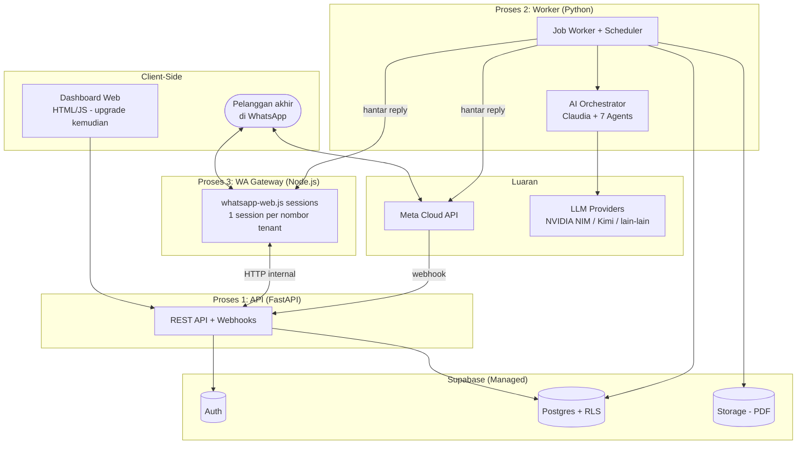
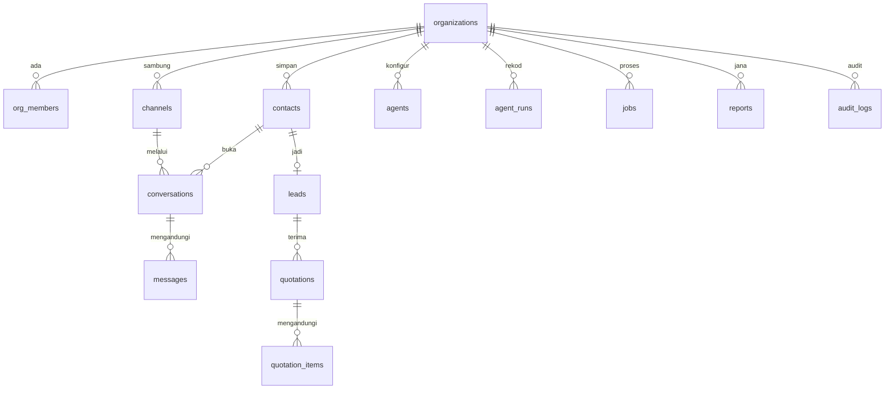
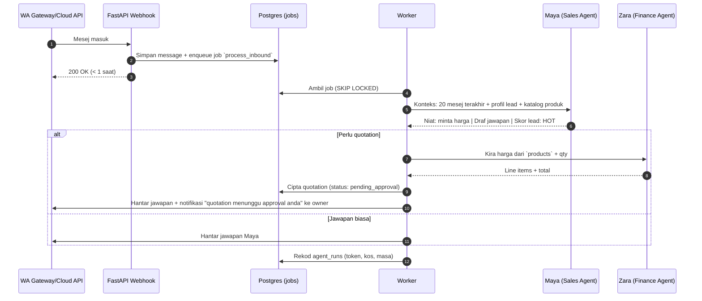

# Cadangan Senibina: AI Command Center v2 (Multi-Tenant SaaS)

> **Status: CADANGAN — menunggu approval.** Tiada kod akan ditulis sehingga dokumen ini diluluskan.
> Tarikh: 2026-07-15 | Disediakan mengikut polisi Architecture-First Development.

---

## 0. Keputusan Yang Telah Dipersetujui

| Keputusan | Pilihan | Implikasi |
|---|---|---|
| Model deployment | Satu platform SaaS, tenant-aware | Setiap jadual ada `org_id`; isolasi data melalui Row-Level Security (RLS) |
| Backend & Database | Supabase (Postgres + Auth + Storage) + FastAPI | Auth, RLS, dan storan PDF disediakan Supabase; FastAPI untuk orkestrasi AI & webhook |
| WhatsApp | Lapisan abstraksi channel: adapter `whatsapp-web.js` (pilot) + `Meta Cloud API` (production) | Tukar provider = tukar config per-tenant, bukan tukar kod |

**Nota risiko whatsapp-web.js** (mesti dimaklumkan kepada client sebelum guna): unofficial, risiko ban nombor, session boleh putus bila WhatsApp update, tiada green tick, ~400-500MB RAM per nombor. Sesuai untuk pilot; client production digalakkan pindah ke Meta Cloud API.

---

## 1. Senibina Keseluruhan

Monolith modular — **bukan** microservices. Tiga proses runtime sahaja, semua boleh scale secara berasingan kemudian tanpa ubah struktur:



**Prinsip kritikal: webhook tak fikir, worker yang fikir.** Endpoint webhook hanya simpan mesej masuk ke DB + enqueue job, kemudian balas `200 OK` dalam milisaat. Semua kerja LLM (yang ambil 5-30 saat) berlaku di worker. Ini mengelakkan timeout webhook dan membolehkan retry.

### Pilihan yang SENGAJA tidak dibuat (elak overengineering)

| Tidak guna | Sebab | Bila perlu semak semula |
|---|---|---|
| Microservices | 3 proses monolith modular cukup untuk ratusan tenant | Bila ada pasukan dev berasingan per domain |
| Redis / RabbitMQ | Queue berasaskan jadual Postgres (`jobs`) cukup; kurang satu infra untuk diurus | Bila throughput > ~50 job/saat |
| Kubernetes | Docker Compose di satu VPS cukup untuk mula | Bila perlu auto-scaling sebenar |
| Frontend framework baru | index.html sedia ada di-upgrade secara berperingkat | Fasa 2, bila dashboard perlu real-time view |

---

## 2. Domain Model (Phase 3)

### Entiti & hubungan



### Peraturan bisnes utama

1. **Setiap baris data milik satu `org_id`** — tiada pengecualian. Data tanpa org tidak wujud.
2. Satu `contact` (nombor telefon) unik per org; conversation baru dibuka jika conversation lama `closed` atau melebihi 24 jam senyap.
3. `lead` dicipta automatik bila AI mengesan niat membeli; skor `hot | warm | cold` dikira oleh agent Maya, boleh di-override manual.
4. `quotation` melalui status: `draft → pending_approval → sent → accepted/rejected/expired`. **Fasa 1: manusia mesti approve sebelum dihantar** (human-in-the-loop). Auto-send hanya bila client sendiri pilih untuk aktifkan.
5. Semua panggilan LLM direkod dalam `agent_runs` dengan token & kos — asas untuk billing per-tenant kemudian.
6. AI **tidak pernah** memadam data; hanya manusia dengan role `owner/admin` boleh.

### RBAC

| Role | Kebenaran |
|---|---|
| `owner` | Semua, termasuk billing, padam org, urus members |
| `admin` | Urus channels, agents, approve quotation, urus staff |
| `staff` | Lihat conversations/leads, balas manual, cipta draft quotation |
| *(service role)* | Worker & gateway sahaja — bypass RLS, tak pernah didedahkan ke client |

---

## 3. Skema Database (Phase 4)

Semua jadual dalam Postgres (Supabase), semua ada `id uuid pk`, `org_id uuid fk`, `created_at`, `updated_at`. RLS aktif pada **setiap** jadual.

| Jadual | Kolum penting | Nota |
|---|---|---|
| `organizations` | name, slug, plan, status, settings jsonb | Tenant root |
| `org_members` | org_id, user_id (→ auth.users), role | Junction auth ↔ tenant |
| `channels` | type (`wa_webjs`\|`wa_cloud`), phone_number, config jsonb (encrypted), status (`connected`\|`disconnected`\|`pending_qr`) | Satu org boleh ada beberapa nombor |
| `contacts` | phone, name, source (`whatsapp`\|`fb_ads`\|`tiktok_ads`\|`manual`), tags text[] | Unik: (org_id, phone) |
| `conversations` | contact_id, channel_id, status (`open`\|`pending_human`\|`closed`), mode (`ai`\|`human`) | `mode=human` = AI berhenti, staff ambil alih |
| `messages` | conversation_id, direction (`inbound`\|`outbound`), sender (`customer`\|`ai`\|`staff`), body, media_url, external_id, status | `external_id` untuk dedup webhook |
| `leads` | contact_id, score (`hot`\|`warm`\|`cold`), status (`new`\|`qualified`\|`quoted`\|`won`\|`lost`), interest_summary, score_reason | AI isi `score_reason` — transparency |
| `quotations` | lead_id, number (auto: Q-{org}-{seq}), status, currency, subtotal, tax, total, pdf_path, valid_until, approved_by | PDF di Supabase Storage, bucket per-org path |
| `quotation_items` | quotation_id, description, qty, unit_price, line_total | |
| `products` | name, description, unit_price, stock_qty nullable | Asas untuk quotation & (Fasa 2) inventory |
| `agents` | org_id **nullable**, name, role_key (`claudia`\|`maya`\|`zara`...), system_prompt, model, provider, enabled | org_id NULL = template default; org boleh override prompt |
| `agent_runs` | agent_id, trigger (`webhook`\|`schedule`\|`manual`), input_summary, output_summary, tokens_in, tokens_out, cost_usd, duration_ms, status, error | Kos per-tenant = SUM per org |
| `jobs` | type, payload jsonb, status (`pending`\|`running`\|`done`\|`failed`), run_at, attempts, max_attempts, last_error | Queue Postgres — `FOR UPDATE SKIP LOCKED` |
| `reports` | type (`daily_briefing`\|`weekly_finance`), period_start, period_end, content_md, delivered_via | |
| `audit_logs` | actor_type (`user`\|`agent`\|`system`), actor_id, action, entity, entity_id, meta jsonb | Append-only, tiada UPDATE/DELETE policy |

### Corak RLS (dipakai pada semua jadual)

```sql
create policy tenant_isolation on {table}
  for all using (
    org_id in (select org_id from org_members where user_id = auth.uid())
  );
```

Worker/gateway guna `service_role` key (server-side sahaja) dan **wajib** filter `org_id` secara eksplisit dalam kod repository — dua lapis perlindungan.

---

## 4. Senibina AI Orchestration

> **Digantikan.** Reka bentuk orkestrator custom + provider NVIDIA NIM/Kimi di bawah ini telah digantikan oleh [ai-execution-crewai.md](ai-execution-crewai.md), yang menggunakan CrewAI sebagai orchestration framework dan OpenAI sebagai satu-satunya provider untuk MVP (di sebalik lapisan abstraksi provider-agnostic). Guardrails §4 di bawah (harga dari DB sahaja, human-in-the-loop, audit_logs, budget guard) kekal terpakai — dibawa terus ke dokumen baharu. Bahagian lain proposal ini (§1-3, §5-11: multi-tenancy, RLS, auth, WhatsApp gateway, billing) kekal sah sepenuhnya.

### Lapisan abstraksi provider

```
ai/providers/base.py      → class LLMProvider: complete(messages, model, tools) -> LLMResult
ai/providers/nvidia.py    → NVIDIA NIM (sedia ada)
ai/providers/openai_compat.py → mana-mana endpoint OpenAI-compatible (Kimi, Groq, dll.)
```

Setiap `agents.provider` + `agents.model` menentukan provider mana digunakan — per-agent, per-tenant. Tambah provider baru = satu fail adapter, sifar perubahan pada orchestrator.

### Aliran orkestrasi (contoh: mesej WhatsApp masuk)



### Guardrails AI (peraturan tegas)

1. AI hanya guna harga dari jadual `products` — **tidak pernah** mereka-reka harga.
2. Jika keyakinan rendah / soalan di luar skop → set `conversations.mode = human`, notify staff. Lebih baik senyap daripada jawab salah.
3. Setiap output agent yang mencetuskan tindakan (cipta quotation, hantar mesej) direkod dalam `audit_logs` dengan `actor_type = agent`.
4. Budget guard: had token harian per-org (dalam `organizations.settings`); melebihi had → pause AI, notify owner.

---

## 5. Lapisan Channel WhatsApp

```
channels/base.py        → class WhatsAppProvider:
                            send_text(channel, to, body)
                            send_document(channel, to, file_url, caption)
                            parse_inbound(payload) -> InboundMessage
channels/wa_webjs.py    → panggil WA Gateway (Node) via HTTP internal
channels/wa_cloud.py    → panggil Meta Graph API + verify webhook signature
```

**WA Gateway (Node.js, proses berasingan):**
- Satu proses Node urus banyak session whatsapp-web.js (satu per `channel` yang `type=wa_webjs`).
- Endpoint internal: `POST /sessions/{channel_id}/send`, `GET /sessions/{channel_id}/qr`, `GET /sessions/{channel_id}/status`.
- Mesej masuk → POST ke FastAPI `/webhooks/wa-gateway` (dengan shared secret internal).
- Session data disimpan dalam volume Docker (`LocalAuth`) supaya tak perlu scan QR semula selepas restart.
- **Had kapasiti diketahui:** ~10-15 session per VPS 8GB RAM. Melebihi itu → tambah VPS gateway atau pindahkan tenant ke Cloud API.

Onboarding client (webjs): daftar → cipta channel → dashboard papar QR → client scan → connected. 5 minit, tiada verification Meta.

---

## 6. Struktur Folder & Sempadan Modul

```
InfinityAI-Solutions/
├── app/                        # FastAPI (Python)
│   ├── main.py                 # Entry: mount routers, middleware, startup checks
│   ├── core/                   # config.py, logging.py, security.py, errors.py
│   ├── api/                    # HTTP sahaja — TIADA logik bisnes
│   │   ├── auth.py, orgs.py, channels.py, conversations.py,
│   │   ├── leads.py, quotations.py, agents.py, reports.py
│   │   └── webhooks.py         # /webhooks/wa-gateway, /webhooks/wa-cloud
│   ├── services/               # Logik bisnes — TIADA HTTP, TIADA SQL mentah
│   │   ├── inbound.py          # proses mesej masuk (dipanggil worker)
│   │   ├── lead_scoring.py, quotation.py (+ jana PDF), briefing.py
│   ├── ai/                     # CrewAI + provider layer — rujuk ai-execution-crewai.md §2
│   │   ├── providers/          # base (LLMProvider ABC), openai_provider, registry, errors
│   │   ├── crewai_adapter/     # InfinityLLMAdapter(BaseLLM), callbacks -> agent_runs
│   │   ├── agents/              # registry + factory: DB row -> crewai.Agent
│   │   ├── flows/               # TaskExecutionFlow (gantikan orchestrator.py lama)
│   │   ├── tools/               # crewai @tool (future: product/pricing lookup)
│   │   └── prompts/            # resolusi system_prompt: default vs override org
│   ├── channels/               # base, wa_webjs, wa_cloud
│   ├── db/                     # supabase client + repositories/ (satu-satunya lapisan sentuh DB)
│   └── workers/
│       ├── runner.py           # poll jobs loop
│       ├── scheduler.py        # APScheduler: enqueue jobs berkala (briefing, dll.)
│       └── handlers/           # process_inbound, generate_quotation, daily_briefing
├── gateway-wa/                 # Node.js whatsapp-web.js service
├── supabase/migrations/        # SQL migrations (versioned)
├── web/                        # dashboard (index.html sedia ada, upgrade berperingkat)
├── tests/                      # pytest: unit (services, ai) + integration (api)
├── docker-compose.yml          # api + worker + gateway-wa
└── docs/
```

**Aturan dependency (sehala):** `api → services → (ai | channels | db)`. Worker handlers → services. Tiada import terbalik. `db/repositories` satu-satunya tempat query — senang audit isolasi `org_id`.

---

## 7. Kontrak API (endpoint utama sahaja)

| Method & Path | Fungsi | Role min |
|---|---|---|
| `POST /webhooks/wa-gateway` | Mesej masuk dari gateway (shared secret) | internal |
| `POST /webhooks/wa-cloud` | Webhook Meta (signature verified) | internal |
| `GET /orgs/me` | Maklumat org + plan semasa | staff |
| `POST /channels` / `GET /channels/{id}/qr` | Sambung nombor WhatsApp | admin |
| `GET /conversations?status=open` | Senarai perbualan | staff |
| `POST /conversations/{id}/takeover` | Staff ambil alih dari AI | staff |
| `POST /conversations/{id}/messages` | Balas manual | staff |
| `GET /leads?score=hot` | Senarai lead + skor | staff |
| `POST /quotations/{id}/approve` | Approve & hantar quotation | admin |
| `GET /reports/briefing/latest` | Briefing harian terkini | staff |
| `GET /usage` | Token & kos bulan ini | owner |

Semua respons ralat: `{ "error": { "code": "...", "message": "mesej generik" } }` — perincian dalaman ke log sahaja (kekalkan pembaikan audit lepas).

### Jenis job (kontrak event dalaman)

`process_inbound` · `generate_quotation_pdf` · `send_message` · `daily_briefing` · `follow_up_reminder` (Fasa 3) · `sync_ads_metrics` (Fasa 2)

Setiap job: retry max 3 kali dengan backoff; gagal kekal → status `failed` + rekod `last_error` + notify (log/alert).

---

## 8. Keselamatan, Logging & Deployment

**Keselamatan:**
- Supabase Auth (email/password + magic link); JWT disahkan di FastAPI middleware.
- RLS pada semua jadual + filter `org_id` eksplisit di repositories (dua lapis).
- `channels.config` (token API) di-encrypt at rest; secrets melalui env, tiada dalam repo.
- Webhook Meta: verify `X-Hub-Signature-256`. Gateway internal: shared secret + network Docker internal sahaja.
- Rate limiting pada endpoint public. Security headers & CORS (sudah ada dari audit lepas — kekal).
- **PDPA:** data pelanggan client terasing per-tenant; endpoint export & delete data per-org (keperluan minimum pematuhan).

**Logging & monitoring:** `logging` berstruktur (JSON) dengan `org_id` + `job_id` dalam setiap rekod; `GET /healthz` untuk API, heartbeat row untuk worker & gateway; kos LLM dipantau melalui `agent_runs`.

**Deployment:** Docker Compose di satu VPS (cadangan: 8GB RAM untuk mula) — container `api`, `worker`, `gateway-wa`; Supabase cloud (managed, backup automatik). Nota: Hugging Face Spaces **tidak sesuai** lagi (gateway perlu proses persistent + volume). Scaling path: API horizontal ✓ (stateless), worker tambah instance ✓ (SKIP LOCKED selamat), gateway tambah VPS per ~10-15 nombor.

---

## 9. Risiko Senibina

| Risiko | Impak | Mitigasi |
|---|---|---|
| Nombor client kena ban (webjs) | Tinggi — reputasi | Persetujuan bertulis client sebelum guna webjs; rate-limit outbound; laluan migrasi ke Cloud API sedia terbina |
| WhatsApp Web update pecahkan webjs | Sistem terhenti | Pin versi library; monitor status session; alert automatik bila disconnect |
| Kos LLM tak terkawal | Margin terhakis | Budget guard per-org + `agent_runs` tracking dari hari pertama |
| AI jawab salah/reka fakta pada pelanggan sebenar | Reputasi client | Guardrails §4: harga dari DB sahaja, human approval untuk quotation, escalate bila tak pasti |
| Kebocoran data antara tenant | Kritikal — undang-undang | RLS + filter eksplisit + ujian automatik isolasi tenant dalam CI |
| Vendor lock-in Supabase | Sederhana | Postgres standard + migrations SQL — boleh pindah ke Postgres self-hosted; hanya Auth & Storage perlu ganti |

---

## 10. Pelan Milestone (Phase 6)

Setiap milestone: nilai bisnes tersendiri, boleh diuji berasingan, production-ready, tidak memecahkan senibina sebelumnya.

### M0 — Foundation (Fasa 0)
Skema Supabase penuh + RLS + migrations; Auth & onboarding org (register → cipta org → jemput member); lapisan provider LLM + pindahkan 8 agent prompt sedia ada ke DB; worker + jobs queue + scheduler; audit log & agent_runs; CI: pytest + ujian isolasi tenant.
**Ujian penerimaan:** dua org berdaftar tidak boleh nampak data satu sama lain (dibuktikan dengan automated test); satu agent run direkod lengkap dengan kos.

### M1 — WhatsApp Sales Funnel (Fasa 1) ← killer feature
Gateway whatsapp-web.js + sambung channel via QR; inbound → Maya faham konteks & balas; lead scoring automatik; quotation draft (Maya+Zara, harga dari `products`) → PDF → approval owner → hantar; takeover manual oleh staff.
**Ujian penerimaan:** pelanggan sebenar WhatsApp nombor pilot → terima jawapan relevan → minta harga → owner approve → PDF sampai di WhatsApp pelanggan. Hujung-ke-hujung, tanpa sentuh kod.

### M1.5 — Daily Business Briefing
Scheduler jam 8 pagi → Claudia ringkaskan (mesej semalam, lead baru, quotation pending, cadangan tindakan) → hantar ke WhatsApp owner.
**Ujian penerimaan:** briefing tiba automatik dengan data sebenar semalam.

### M2 — Content & Ads (Fasa 2)
Content pipeline (Danish → approve → jadual posting); integrasi Meta/TikTok Ads (baca metrik, cadangan); adapter Meta Cloud API siap untuk tenant production.

### M3 — Finance & Follow-up (Fasa 3)
Auto rekod sales; laporan mingguan; kempen follow-up automatik (cart/belum bayar); inventory alert.

### M4 — R&D (TIDAK dijanjikan kepada client)
Autonomous daily ops; self-improving loop; competitor monitoring. Dinilai semula selepas M3 berdasarkan data sebenar.

---

## 11. Yang Diselamatkan Dari Sistem Sedia Ada

- Rekaan peranan & prompt 8 agent ([main.py](../../main.py)) → dipindahkan ke jadual `agents` sebagai template default.
- Pembaikan keselamatan dari [audit-report-2026-07.md](../development/audit-report-2026-07.md) (XSS fix, error handling, security headers, JSON parsing) → dikekalkan sebagai standard.
- [index.html](../../index.html) → asas dashboard, upgrade berperingkat.
- Google Drive/GAS → digantikan Supabase Storage (Drive boleh kekal sebagai export destination pilihan client, bukan storan utama).

---

*Selepas dokumen ini diluluskan, langkah pertama ialah M0 — dan setiap milestone akan ada dokumen teknikal terperinci sendiri sebelum implementasi.*
